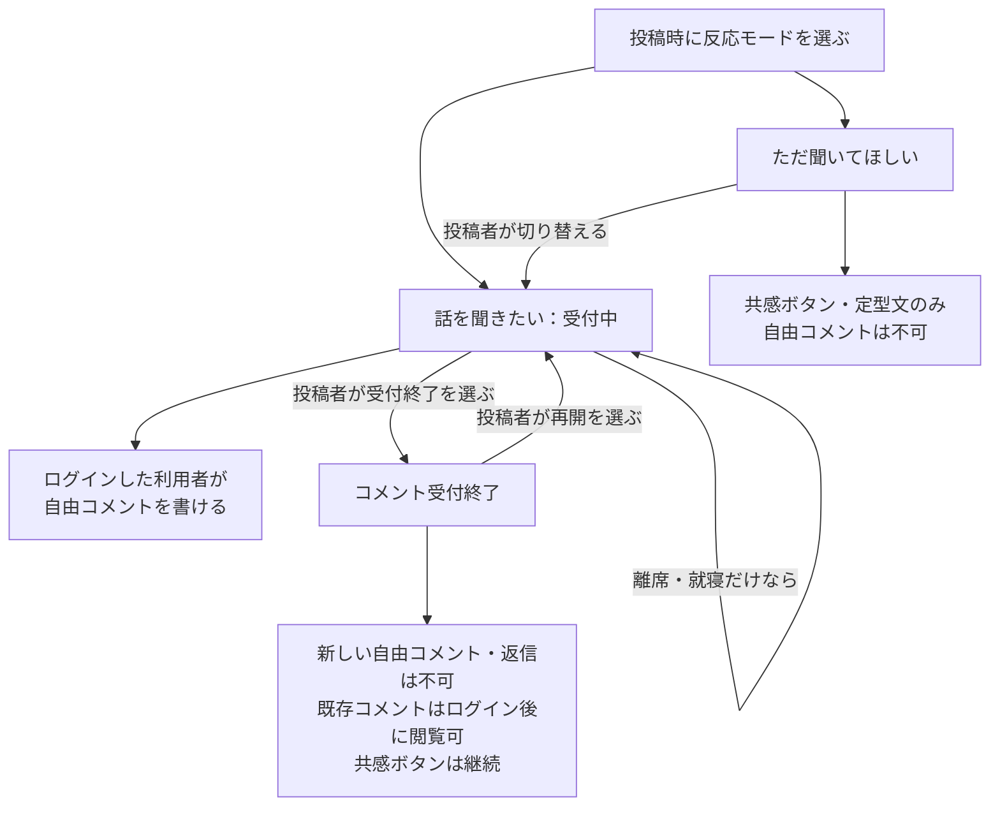
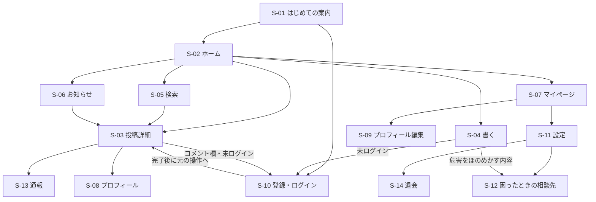
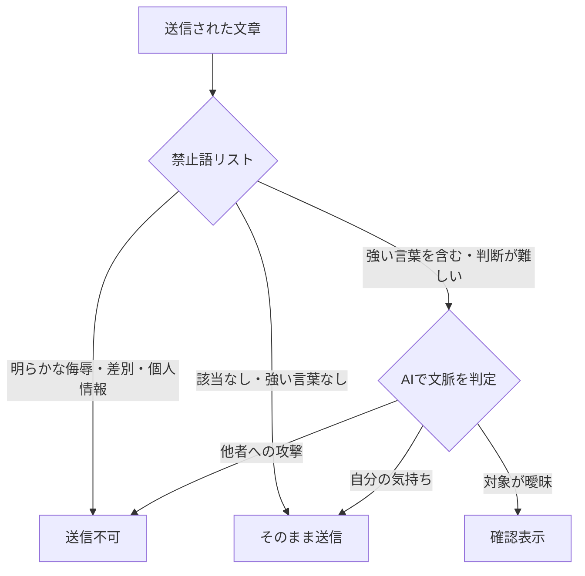

# 子育てぐちSNS 全体設計書

> 文書名: 子育てぐちSNS 全体設計書
> アプリ名: 未定(候補「ひと息」)
> バージョン: v0.2(要件定義ベース・2026-09-29時点)
> ステータス: 要件定義中・実装未着手

> 📝 詳細な要求仕様(機能ごとの受入条件・決定ログ等)は、
> Notion「[子育てぐちSNS 要件定義書](https://app.notion.com/p/3e95b8f5ffee8171bf86f976d5d5b2ec)」で一元管理している。
> 本書はそれをもとに、このリポジトリのコードベースと対応づけて要点をまとめたもの。仕様の変更は
> まずNotion側を更新し、本書は実装への影響がある範囲で追従する。

---

## 1. プロジェクト目標

### コンセプト
子育てでしんどさを感じたときにぐちをこぼし、コメントで共感・子育てのコツ・体験談を共有できる場所。

### コアバリュー
- **吐き出せる安心感**: 身近な人には言いづらい子育ての気持ちを言葉にできる
- **「自分だけじゃない」**: 同じような経験を持つ人との交流で孤立感を和らげる
- **押しつけない共有**: コメントを通じて子育てのコツ・体験談を「うちの場合は」の形で伝え合う

成功の確かめ方は数値目標ではなく、「話せた」「受け止めてもらえた」と感じられたかを重視する(数値目標は利用者への聞き取り後に決定)。

### スコープ外(初期版では対応しない)
- DM、画像・動画投稿、フォロー機能、人気ランキング
- 広告・課金システム(収益化は利用者が増えてから検討、6.5参照)
- AIによる自動返信
- Webでの一般公開・検索エンジンへの掲載(スマホアプリ内での閲覧が前提)

---

## 2. 対象ユーザー

| 属性 | ニーズ |
|---|---|
| 子育ての疲れや不満を話したい養育者 | 知人との関係を気にせず気持ちを吐き出したい |
| 解決策より共感がほしい人 | 「わかる」と言ってもらえるだけで楽になりたい |
| 他の人の工夫を知りたい人 | コメントで子育てのコツ・体験談を得たい |

子どもの年齢では対象を絞らない(決定)。養育者の範囲・利用者自身の年齢制限・対応言語や地域は未決定。

---

## 3. 主要機能一覧

| No | 機能名 | 概要 | 状態 |
|---|---|---|---|
| F-01 | ぐち・相談・コツ/体験談の投稿・閲覧 | 投稿種類を選んで本文(1,000文字まで)を共有。編集・削除可 | 投稿種類は決定・詳細検討中 |
| F-02 | アカウントごとのニックネーム | 投稿・コメントに同じ名前を表示(2〜12文字・重複不可・30日に1回変更可) | 採用決定・詳細検討中 |
| F-03 | 共感リアクション | 運営用意の定型文5〜8種から1投稿1人1つ。件数は投稿者にのみ表示 | 採用決定・文言等は検討中 |
| F-04 | コメント・コツと体験談の共有 | 反応モードに応じて自由コメント(500文字まで)・返信1段階まで | 採用決定・詳細検討中 |
| F-05 | 非表示・ブロック・通報 | 3件通報で自動一時非表示。通報理由6種・対処段階を定義済み | 公開前候補 |
| F-06 | 話題の分類・絞り込み | 一覧は新着順のみ。話題(任意1つ)・投稿種類で絞り込み | 採用決定・詳細検討中 |
| F-07 | 簡単なプロフィール | ニックネーム・選択式アイコン・自己紹介100文字・子どもの年齢帯 | 採用決定・詳細検討中 |
| F-08 | キーワード検索 | 投稿本文を検索(未ログインでも利用可) | 採用決定・詳細検討中 |
| F-09 | 投稿の保存 | 自分だけの一覧であとから読める(相手には非通知) | 採用決定・詳細検討中 |
| F-10 | ミュート(話題・言葉) | 指定した話題・言葉を含む投稿を自分にだけ非表示 | 採用決定・詳細検討中 |
| F-11 | 管理画面 | 通報一覧・非表示解除/削除・警告/利用停止の3画面(最小版) | 採用決定・詳細検討中 |

### 反応モードとコメント受付の関係

投稿画面の初期選択は「ただ聞いてほしい」。受付終了後も投稿者はいつでも再開できる(決定)。

最小版の範囲: 簡単なプロフィール、コメント機能(コツ・体験談の共有含む)、投稿種類選択(ぐち/相談/コツ体験談)、アカウントごとのニックネーム、共感リアクション、非表示・ブロック・通報を組み合わせる案。詳細範囲は引き続き検討。

---

## 4. 画面一覧・画面遷移

スマートフォンアプリ(iPhone・Android)。画面下部タブは「ホーム」「検索」「書く」「お知らせ」「マイページ」の5つ。

| ID | 画面 | 主な内容 | ログイン |
|---|---|---|---|
| S-01 | はじめての案内 | アプリ説明・利用ルールの要点 | 不要 |
| S-02 | ホーム(投稿一覧) | 新着順一覧。投稿種類・話題で絞り込み | 不要 |
| S-03 | 投稿詳細 | 本文・共感・コメント欄・返信。非表示/ブロック/通報/保存 | 本文は不要、コメント欄以降は必要 |
| S-04 | 書く(投稿作成・編集) | 投稿種類・話題(任意)・反応モード・本文1,000文字・送信前チェック | 必要 |
| S-05 | 検索 | キーワード検索(投稿本文対象) | 不要 |
| S-06 | お知らせ | コメント・共感の通知、運営からの連絡 | 必要 |
| S-07 | マイページ | 自分の投稿・保存投稿・プロフィール・設定への入口 | 必要 |
| S-08 | プロフィール(他の人) | ニックネーム・アイコン・自己紹介・年齢帯 | 必要 |
| S-09 | プロフィール編集 | ニックネーム・アイコン・自己紹介・年齢帯の編集 | 必要 |
| S-10 | 登録・ログイン | メール/Google/Apple | ― |
| S-11 | 設定 | 通知・ミュート・ブロック管理、規約、退会 | 必要 |
| S-12 | 困ったときの相談先 | 公的相談窓口へのリンク | 不要 |
| S-13 | 通報 | 通報理由6種から選択 | 必要 |
| S-14 | 退会 | 削除内容の説明と確認 | 必要 |
| A-01〜 | 管理画面 | 通報一覧・非表示解除/削除・警告/利用停止(F-11) | 運営者のみ・二段階認証 |

ワイヤーフレームv0.1(主要5画面: ホーム・投稿詳細・書く・送信前チェック・マイページ)を作成しユーザーが一旦了承済み。

### デザイン確定(2026-09-29)

サービス名「ひと息」・配色・書体を含む高精細モックアップ一式が確定。S-01〜S-14ほぼ全画面分。詳細は[docs/design/](design/README.md)を参照。配色は生成り色の背景にコーラルオレンジのプライマリボタン、黄色のセカンダリボタン、太陽キャラクターのマスコット、選択式イラストのユーザーアイコン。

モックアップで新たに具体化された要素(初回投稿時の注意モーダル、送信不可時の言い換え例表示、未ログイン時のコメント欄ログイン誘導モーダル等)は[docs/design/README.md](design/README.md)の「現行docsとの差分メモ」を参照。

---

## 5. 誹謗中傷の送信前チェック仕様

対象: 投稿本文・自由コメント・返信・ニックネーム・自己紹介。誹謗中傷や差別的な言葉を送信前に防ぐ仕組みは必須要件。ただし、つらい気持ちを吐き出す言葉は制限しない(「自分の気持ち」と「誰かへの攻撃」を分けて扱う)。

**判定方法(決定・2026-09-29)**: 運営費をほぼ0円にするため、公開時は禁止語リスト＋OpenAI Moderation API(無料)で開始。愚痴と攻撃の区別が不十分な場合は有料のAI文脈判定を後から追加する。公開前に実際の投稿例で日本語の精度を検証する。

名前・個人情報(本人・子ども・家族・知人の名前、学校/園/勤務先名等)は送信不可とし、「長男」「夫」など続柄での言い換えを案内する。イニシャルや公人・作品名は機械的には止めない。

**相談先の案内(決定)**: 「消えたい」等、自分や子どもへの危害をほのめかす書き込みは止めずに公開し、本人にだけ相談先(親子のための相談LINE・児童相談所189・まもろうよこころ等)を案内する。

---

## 6. データ設計

未定。機能の採用範囲がほぼ固まったため、次の検討で定義する。

対象エンティティ(想定): 利用者・プロフィール、投稿(種類・話題・反応モード・受付状態)、コメント・返信、共感・定型文、保存、ミュート、ブロック、通報・対処記録、通知、変更前ニックネームの予約。

保存期間・削除の扱い: 投稿は本人が消すまで無期限保存。退会時は投稿・コメント・プロフィール・保存投稿を全削除、ニックネームは30日間再利用不可。通報対応記録は一定期間(例: 1年)保持。バックアップも一定期間(例: 30日)で削除。

---

## 7. 技術スタック

決定済みの前提: iPhone・Androidアプリ(1つのコードで両方に出せる仕組み)、メール/Google/Appleログイン、プッシュ通知、送信前チェック、管理画面(F-11)。

| 案 | アプリ | サーバー | 選定理由 |
|---|---|---|---|
| **A(採用)** | **Flutter** | **Supabase**(無料プランで開始) | ブロック・ミュート・通報など関係データをSQLで扱いやすい。行単位権限(RLS)でサーバー側の権限制御が可能。日本語全文検索(PGroonga等)。メール/Google/Apple認証。送信前チェックをサーバー関数で実装可。既存プロジェクト(ぶらりデートガチャ・クマヨケール)と同じFlutterで開発でき、知見・コード資産を再利用できる |
| B(不採用) | Flutter | Firebase | 実績は多いが全文検索が標準でなく外部サービスが必要。ブロック・ミュートの絞り込みが複雑になりやすい |

> AWS常時無料枠(Lambda/DynamoDB/Cognito等)も検討したが、関係データの扱い・日本語検索・権限やバックアップの自前構築・想定外の請求リスクから見送り(2026-09-29決定)。
> 📝 2026-09-29更新: アプリのフレームワークをExpo(React Native)からFlutterに変更。既存プロジェクトとの技術スタック統一のため。

### リポジトリ構成(決定・2026-09-29)

フロントエンド(Flutterアプリ本体)とバックエンド(Supabaseのマイグレーション・RLSポリシー・Edge Functions等の設定一式)を別リポジトリに分ける。`kumayokeru-app` / `kumayokeru-backend` の構成に倣う。

| リポジトリ | 内容 |
|---|---|
| kosodate-hitoiki | Flutterアプリ本体(このリポジトリ) |
| [kosodate-hitoiki-backend](https://github.com/naka328/kosodate-hitoiki-backend) | SupabaseのDBスキーマ(マイグレーション)、RLSポリシー、Edge Functions(送信前チェック等) |

**無料で公開するための条件**:
- Supabase無料プラン(DB 500MB・5万MAUまで)で開始し、必要になったら有料プラン(Pro 月$25)へ切り替え
- 無料プランは1週間操作がないと一時停止するため、公開直後は要注意・復旧手順を用意
- 自動バックアップがないため、無料の自動化ツールで定期的にDBを書き出し暗号化・非公開で保管(必須)
- 切替の目安: DB容量が8割超、利用者増加で運営が安定、収入が発生し始めたとき

運営費はストア費用(Apple年会費・Google初回登録料)以外ほぼ0円で公開する方針(2026-09-29決定)。

---

## 8. 非機能要件・運用方針

### 公開範囲
投稿本文・コメント件数はログイン不要で閲覧可能。コメント欄の閲覧、投稿の作成、コメントの送信には会員登録とログインが必要。未ログインでコメント欄を開くと登録・ログイン案内を表示する。

### 一般公開と1人運営の両立策
- 登録直後は1日の投稿・コメント数を少なめに制限(荒らし対策・件数未定)
- 利用者数や未対応通報が一定数を超えたら管理画面から新規登録を一時停止可能
- 利用規約に「通報への対応には数日かかることがある」旨を明記し、常時対応を約束しない
- 通報対応は公開当初、運営者(yuki)が1人で担当。異なる利用者から3件の通報で自動一時非表示

### データの扱い
| 項目 | 扱い |
|---|---|
| 運営が持つ情報 | メール/Google・AppleID、ニックネーム、プロフィール、投稿・コメント、通報対処記録。本名・住所・電話番号は集めない |
| 投稿の保存期間 | 本人が消すまで無期限 |
| 退会時 | 投稿・コメント・プロフィール・保存投稿を全削除。ニックネームは30日間再利用不可 |

---

## 9. 収益化モデル

アプリ内の課金システム(サポーター会員・応援機能)は作らない(決定)。収益化は利用者が増えてから、広告(AdMob)・協賛・助成金を候補に検討する。安全に関わる機能(通報・ブロック・ミュート・相談先案内)や投稿・コメントの基本機能は有料にしない方針。広告を出す場合もぐち・相談の投稿画面と相談先ページには出さない。

---

## 10. 開発ロードマップ

現在の段階(2026-09-28時点):
- **完了**: 利用者と体験の定義、コメント仕様・公開範囲・運営体制、最小版の機能と画面一覧・ワイヤーフレームv0.1、配布方法(iPhone/Androidアプリ)
- **次**: データ設計・技術構成の詳細、サービス名の決定
- **その後**: 費用・作業範囲の見積もり

公開時期の目標は設けない。少人数試用は行わず最初から一般公開する方針。

---

## 11. 今後の検討事項

- 反応モードの残り: 逆方向(話を聞きたい→ただ聞いてほしい)の変更可否、受付終了後の定型文
- 対象利用者の残り: 養育者の範囲、利用者自身の年齢制限、対応言語・地域
- サービス名(候補「ひと息」は未確定)
- 通報の「悪質」の基準、利用停止期間、異議申立て
- 利用規約・権利(著作権、二次利用範囲、削除依頼窓口) — 公開前に専門家確認が必要

詳細はNotion「[8. 今後の検討事項](https://app.notion.com/p/3e95b8f5ffee81808119c48e2088771c)」を参照。

---

## 関連ドキュメント

- Notion: [子育てぐちSNS 要件定義書](https://app.notion.com/p/3e95b8f5ffee8171bf86f976d5d5b2ec) — 一次情報源
- ワイヤーフレーム: [子育てぐちSNS ワイヤーフレーム v0.1](https://claude.ai/artifact/FkugZ4faSWwTvCq18Copvc)
- [docs/design/](design/README.md) — 確定デザインモックアップ一式(2026-09-29)
